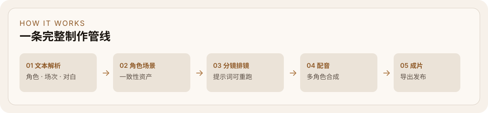

<p align="center">
  
</p>

<h1 align="center">影核 Ark</h1>

<p align="center">
  面向短剧与漫剧的开源 AI 创作台：解析文本、生成角色与场景、排分镜、配音并导出成片。
</p>

<p align="center">
  <a href="README_en.md">English</a>
  ·
  <a href="https://github.com/xiaoyangtx996/Yinghe-Ark/issues">Issues</a>
</p>

<p align="center">
  
</p>

---

## 它是什么

影核 Ark（Yinghe Ark）把「小说 / 剧本 → 可看短片」拆成可回看、可重跑的工作台阶段，而不是一次性黑盒出片。

| 阶段 | 你得到什么 |
| --- | --- |
| 文本解析 | 角色、场次、冲突与对白结构 |
| 角色与场景 | 可复用的一致性人物 / 场景资产 |
| 分镜排镜 | 可改提示词、可重跑单镜 |
| 配音与成片 | 多角色语音 + 镜头合成导出 |

---

## 功能一览

- **AI 剧本分析** — 从小说或草稿抽出角色、场景与剧情节点
- **角色 & 场景生成** — 跨镜头保持外貌与空间一致
- **分镜视频** — 文字转镜头，支持局部重跑
- **AI 配音** — 多角色语音合成
- **资产中心** — 角色 / 场景 / 道具跨项目复用
- **中英双语** — 界面一键切换

---

## 快速开始

**前提**：安装 [Docker Desktop](https://docs.docker.com/get-docker/)（方式一、二）或本机 Node 18+、MySQL、Redis、MinIO（方式三）。

### 方式一：拉取预构建镜像

```bash
curl -O https://raw.githubusercontent.com/xiaoyangtx996/Yinghe-Ark/main/docker-compose.yml
docker compose up -d
```

测试版数据库可能不兼容升级。升级前请先：

```bash
docker compose down -v
docker compose up -d
```

启动后建议清空浏览器缓存再登录。默认访问 [http://localhost:13000](http://localhost:13000)。

### 方式二：克隆仓库 + Docker 构建

```bash
git clone https://github.com/xiaoyangtx996/Yinghe-Ark.git
cd Yinghe-Ark
docker compose up -d
```

更新：

```bash
git pull
docker compose down && docker compose up -d --build
```

### 方式三：本地开发

```bash
git clone https://github.com/xiaoyangtx996/Yinghe-Ark.git
cd Yinghe-Ark

cp .env.example .env
# 编辑 .env：填入 AI API Key；按本机端口调整 MySQL / Redis / MinIO

npm install

# 若使用仓库自带 docker-compose 基础设施（宿主机端口见 .env.example）：
docker compose up mysql redis minio -d

npx prisma db push
npm run dev
```

> [!WARNING]
> 跳过 `npx prisma db push` 会导致表不存在（例如 `tasks`），启动后必报错。

开发模式默认访问 [http://localhost:3000](http://localhost:3000)。

若你本机已有 MySQL `3306` / Redis `6379`，可在 `.env` 中改端口，不必强行起 Docker 映射端口。

---

## API 配置

启动后进入**设置中心**配置各模型服务商的 API Key（内置配置引导）。

目前更推荐官方 API；第三方 OpenAI Compatible 仍在完善中。

---

## 技术栈

- **应用**：Next.js 15 · React 19 · Tailwind CSS v4
- **数据**：MySQL · Prisma
- **任务**：Redis · BullMQ
- **认证**：NextAuth.js
- **存储**：MinIO（S3 兼容）

---

## 界面预览


---

## 状态与参与

项目仍在快速迭代，欢迎通过 Issue 反馈问题与需求。

- 🐛 [提交 Bug](https://github.com/xiaoyangtx996/Yinghe-Ark/issues)
- 💡 [功能建议](https://github.com/xiaoyangtx996/Yinghe-Ark/issues)

---

<p align="center">
  
</p>
