<p align="center">
  
</p>

<h1 align="center">Yinghe Ark</h1>

<p align="center">
  An open-source AI studio for short drama and comic-video workflows: parse text, generate cast and scenes, storyboard, voice, and export.
</p>

<p align="center">
  <sub>Secondary development based on <a href="https://github.com/waooAI/waoowaoo">waoowaoo</a></sub>
</p>

<p align="center">
  <a href="README.md">中文文档</a>
  ·
  <a href="https://github.com/xiaoyangtx996/Yinghe-Ark/issues">Issues</a>
  ·
  <a href="https://github.com/xiaoyangtx996/Yinghe-Ark">GitHub</a>
</p>

<p align="center">
  
</p>

---

## What it is

Yinghe Ark turns “novel / script → watchable short film” into a stage-based workbench you can review and re-run—not a one-shot black box.

| Stage | What you get |
| --- | --- |
| Text analysis | Characters, scenes, conflict, dialogue structure |
| Cast & locations | Reusable, consistent visual assets |
| Storyboard | Editable prompts; re-run a single shot |
| Voice & export | Multi-speaker TTS + composed video |

---

## Features

- **AI script analysis** — extract cast, scenes, and plot beats from text
- **Character & scene generation** — keep looks and spaces consistent across shots
- **Storyboard video** — text to panels with local re-runs
- **AI voiceover** — multi-character speech synthesis
- **AI edit** — shot arrangement and export
- **Asset hub** — reuse characters, locations, and props across projects
- **Provider pool** — multi-model / multi-vendor access and default model setup
- **Bilingual UI** — Chinese / English toggle

---

## Quick start

**Prerequisites**: [Docker Desktop](https://docs.docker.com/get-docker/) (methods 1–2), or Node 18+, MySQL, Redis, and MinIO locally (method 3).

### Method 1: Pre-built image

```bash
curl -O https://raw.githubusercontent.com/xiaoyangtx996/Yinghe-Ark/main/docker-compose.yml
docker compose up -d
```

Beta databases may not upgrade cleanly. Before upgrading:

```bash
docker compose down -v
docker compose up -d
```

Clear browser cache after upgrades. Default URL: [http://localhost:13000](http://localhost:13000).

### Method 2: Clone + Docker build

```bash
git clone https://github.com/xiaoyangtx996/Yinghe-Ark.git
cd Yinghe-Ark
docker compose up -d
```

Update:

```bash
git pull
docker compose down && docker compose up -d --build
```

### Method 3: Local development

```bash
git clone https://github.com/xiaoyangtx996/Yinghe-Ark.git
cd Yinghe-Ark

cp .env.example .env
# Add AI API keys; adjust MySQL / Redis / MinIO ports for your machine

npm install

# Optional: infra from docker-compose (host ports in .env.example)
docker compose up mysql redis minio -d

npx prisma db push
npm run dev
```

> [!WARNING]
> Skipping `npx prisma db push` leaves tables missing (e.g. `tasks`) and the app will fail on start.

Dev URL: [http://localhost:3000](http://localhost:3000).

If you already run MySQL on `3306` and Redis on `6379`, point `.env` at those ports instead of the compose-mapped ones.

---

## API setup

Open **Settings** after launch and configure provider API keys (guided in-app).

Official provider APIs are recommended; third-party OpenAI-compatible endpoints are still maturing.

---

## Stack

- **App**: Next.js 15 · React 19 · Tailwind CSS v4
- **Data**: MySQL · Prisma
- **Jobs**: Redis · BullMQ
- **Auth**: NextAuth.js
- **Storage**: MinIO (S3-compatible)

---

## Product gallery

> Screenshots live under `images/` (repo-relative paths). First load on GitHub may take a moment while images cache.

### Creative workbench

From projects and story breakdown through storyboard, voice, export, and the asset hub.

<table>
  <tr>
    <td width="50%" align="center"><strong>Projects</strong><br/>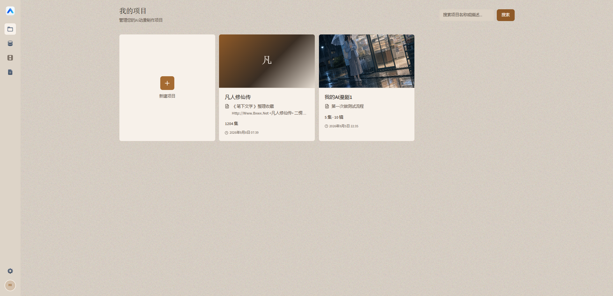</td>
    <td width="50%" align="center"><strong>Story</strong><br/>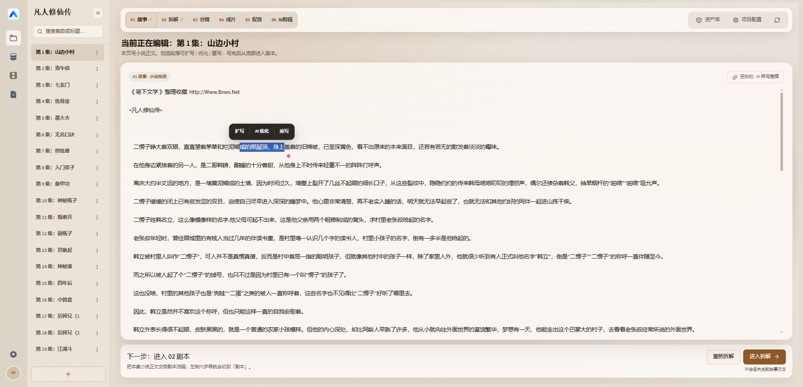</td>
  </tr>
  <tr>
    <td width="50%" align="center"><strong>Breakdown</strong><br/>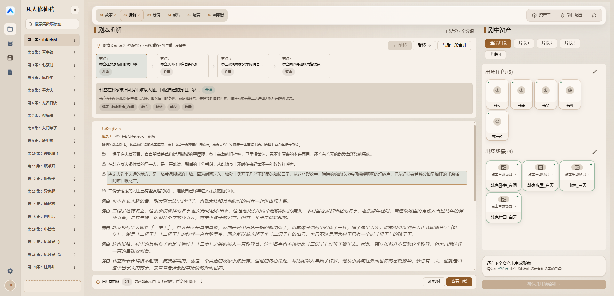</td>
    <td width="50%" align="center"><strong>Storyboard</strong><br/>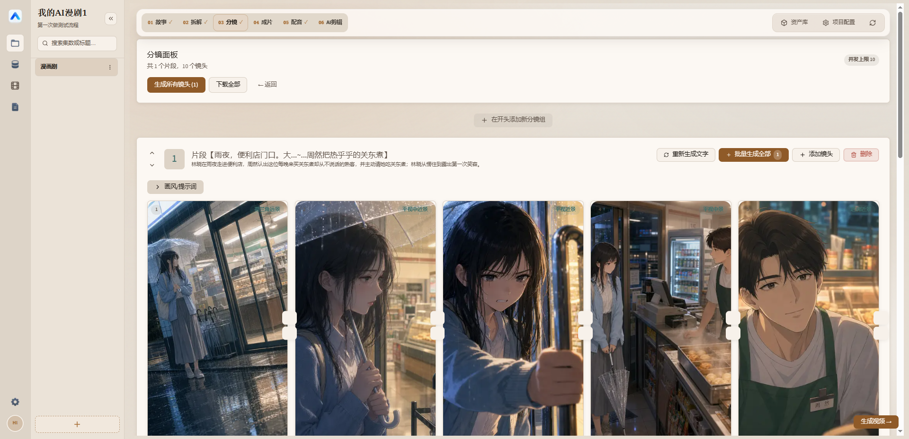</td>
  </tr>
  <tr>
    <td width="50%" align="center"><strong>Storyboard detail</strong><br/>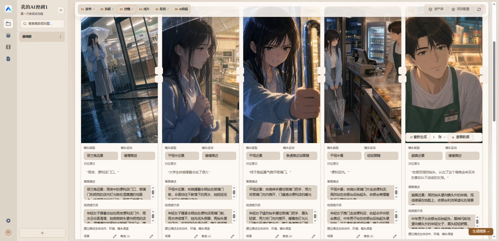</td>
    <td width="50%" align="center"><strong>Voice</strong><br/>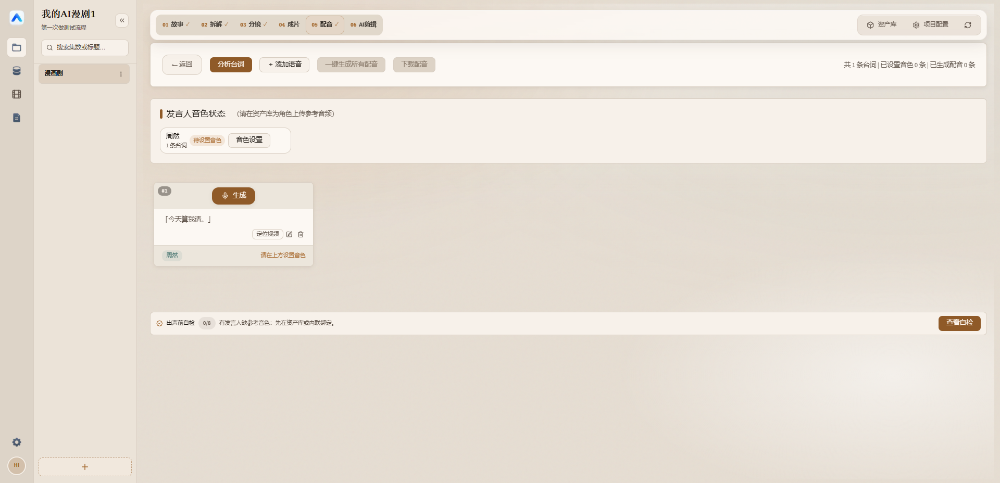</td>
  </tr>
  <tr>
    <td width="50%" align="center"><strong>Export</strong><br/>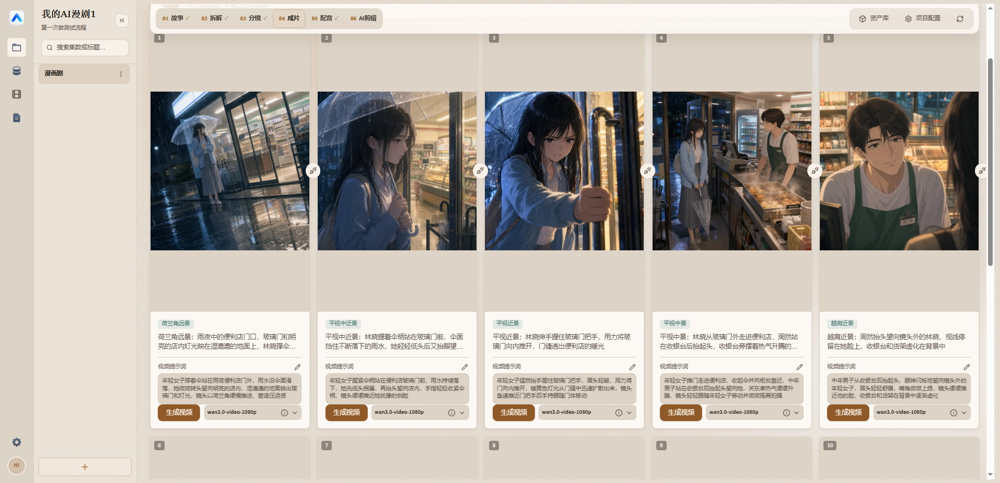</td>
    <td width="50%" align="center"><strong>Export library</strong><br/>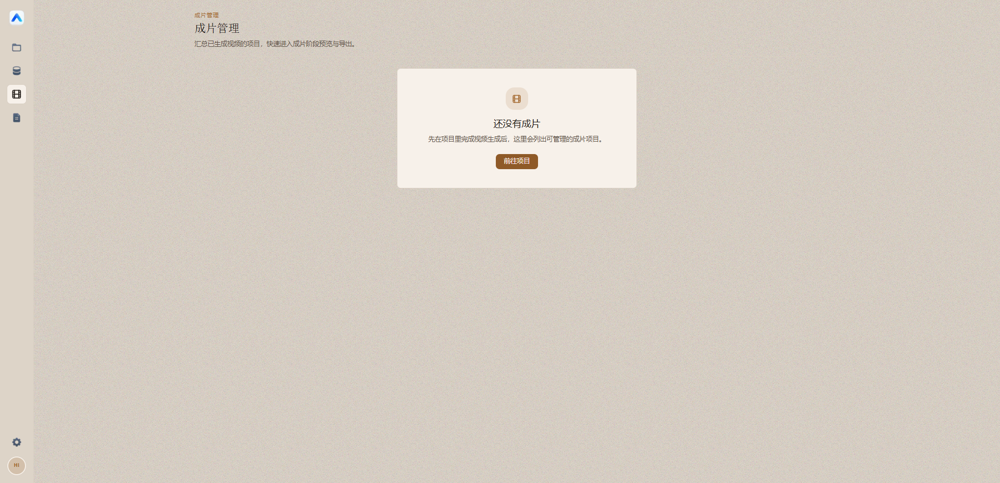</td>
  </tr>
  <tr>
    <td width="50%" align="center"><strong>Asset hub</strong><br/>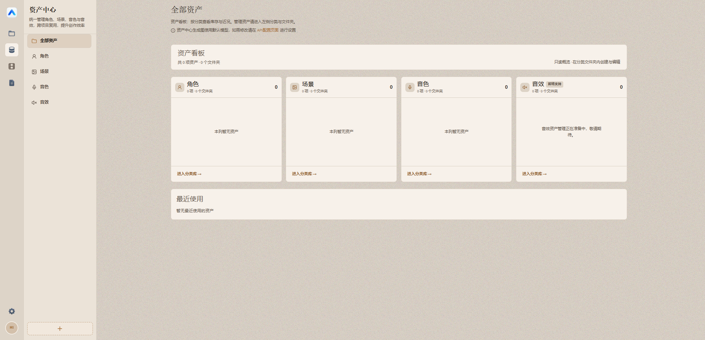</td>
    <td width="50%" align="center"><strong>AI edit</strong><br/>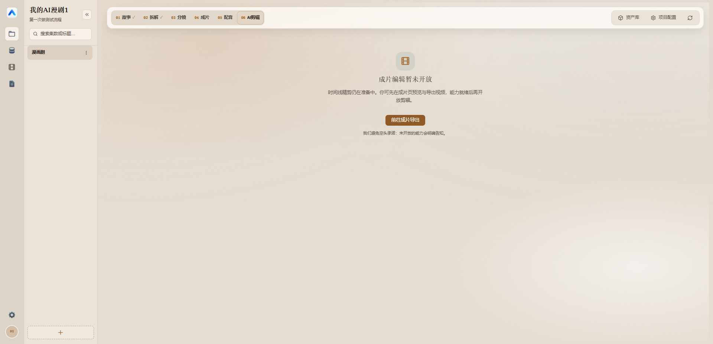</td>
  </tr>
</table>

### Settings & ops

Default models, provider pool, account / user settings, and logs.

<table>
  <tr>
    <td width="50%" align="center"><strong>Default models</strong><br/>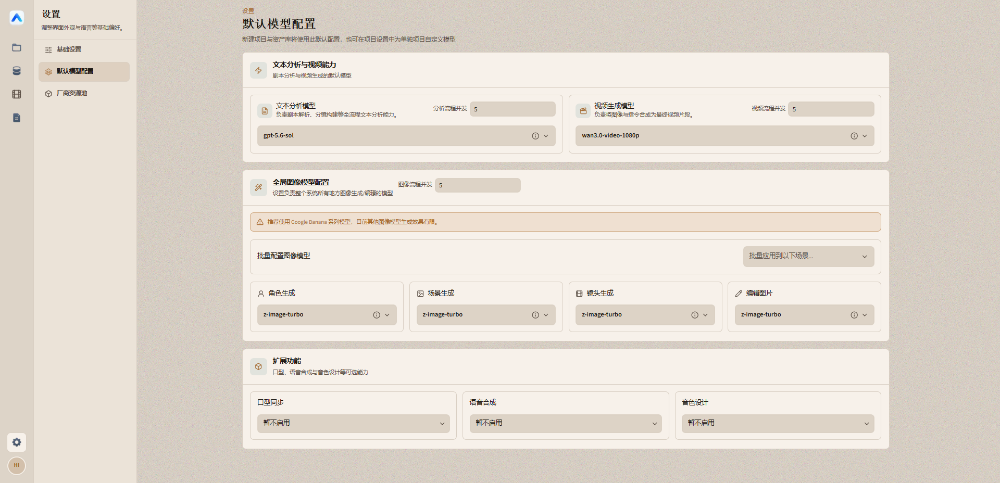</td>
    <td width="50%" align="center"><strong>Provider pool</strong><br/>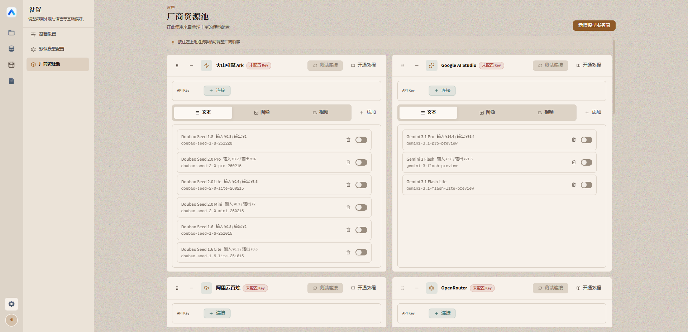</td>
  </tr>
  <tr>
    <td width="50%" align="center"><strong>User settings</strong><br/>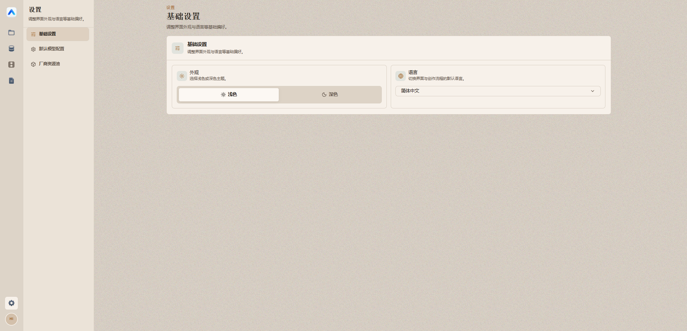</td>
    <td width="50%" align="center"><strong>Account</strong><br/>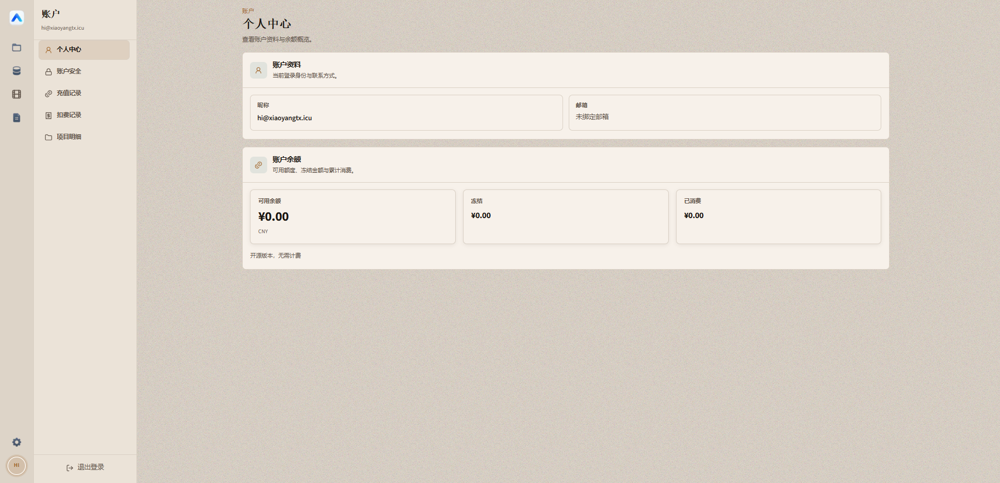</td>
  </tr>
  <tr>
    <td width="50%" align="center" colspan="2"><strong>Logs</strong><br/>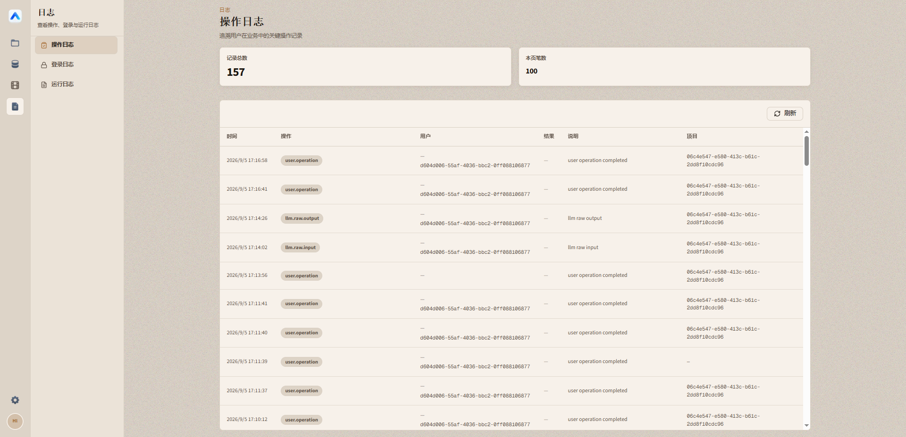</td>
  </tr>
</table>

---

## Status & contributing

The project iterates quickly. Feedback via Issues is welcome.

- 🐛 [Bugs](https://github.com/xiaoyangtx996/Yinghe-Ark/issues)
- 💡 [Ideas](https://github.com/xiaoyangtx996/Yinghe-Ark/issues)

---

## Acknowledgments

Yinghe Ark is a secondary development based on the open-source project [waoowaoo](https://github.com/waooAI/waoowaoo). Thanks to the upstream authors and community.

---

<p align="center">
  
</p>
